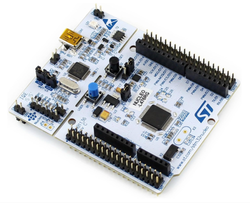

# STM-Overview

Arquitectura interna de los procesadores STM32 Nucleo.
## Descripción general

Veremos un resumen de como es la arquitectura interna de los procesadores STM32 Nucleo, lo que nos permite desarrollar programas eficientes para nuestros proyectos. Para esta explicación se tiene como base el microcontrolador **STM-32L476RGT6**.

## Procesadores ARM
---
La elección de un microcontrolador en particular para el desarrollo de un proyecto depende de algunos factores como los siguientes:
- Costo
- Velocidad
- Consumo de energía
- Tamaño
- Número de puertos de entrada/salida digitales y analógicos
- Resolución y precisión del puerto analógico
- Tamaños de memoria del programa y datos
- Soporte de interrupciones
- soporte de temporizador
- Soporte USART
- Soporte de bus especial (por ejemplo, USB, CAN, SPI, I2C ...)
- Tensión de trabajo del microcontrolador

